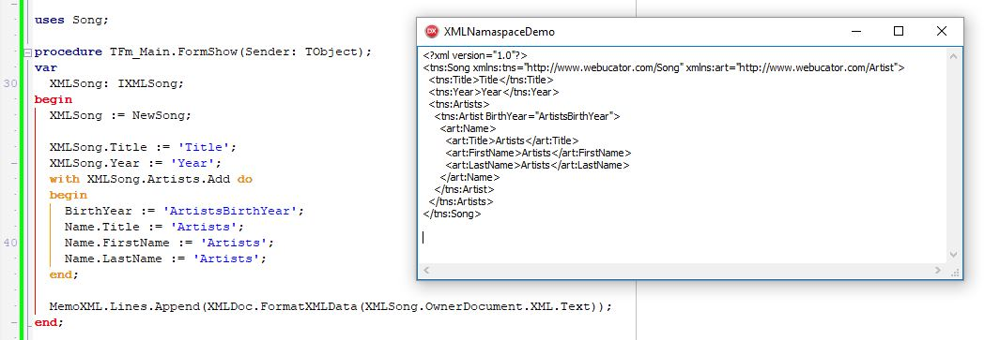

# XMLDocHelper

This unit hooking delphi methods and allows easy use units created with Delphi XML Binding Wizard with multiple namespace and proper prefixes.

## Usage
See demo files and use [XMLDataBindingFix](https://github.com/miszellek/XMLDataBindingFix/releases/) for files generated by Delphi.

## Dependency
[Delphi Detours Library](https://github.com/MahdiSafsafi/DDetours)

## Contributing

### Bug Reports and Feature Requests

Please use [issue tracker](https://github.com/miszellek/XMLDocHelper/issues) for reporting bugs or feature requests.

### Development

Tested on Delphi 10 Seattle.
Pull requests are most welcome.

## License

MIT © Miszel

## Buy the developer a beer!

If you found my work helpful you can buy me a beer using

